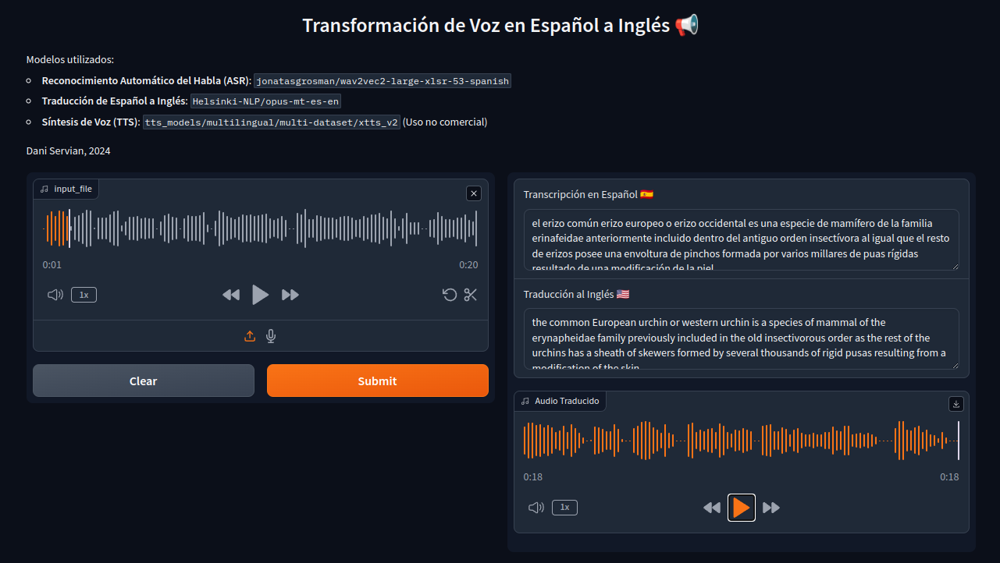

# Transformación de Voz en Español a Inglés

Este proyecto utiliza modelos de inteligencia artificial para transcribir audio en español, traducirlo al inglés, y luego generar un nuevo audio en inglés con la voz del hablante original.

## Características

- Reconocimiento Automático del Habla (ASR) para transcribir audio en español
- Traducción de texto de español a inglés
- Síntesis de voz (TTS) para generar audio en inglés con clonación de voz
- Interfaz gráfica de usuario con Gradio



## Requisitos Previos

- Python > 3.7 < 3.11
- PyTorch
- CUDA (opcional, pero recomendado para mejor rendimiento)

## Instalación

1. Clona este repositorio:
   ```
   git clone https://github.com/tu-usuario/transformacion-voz-es-en.git
   ```

2. Navega al directorio del proyecto:
   ```
   cd transformacion-voz-es-en
   ```

3. Instala las dependencias:
   ```
   pip install -r requirements.txt
   ```

## Uso

1. Ejecuta el script principal:
   ```
   python app.py
   ```

2. Se abrirá una interfaz de Gradio en tu navegador web.

3. Sube un archivo o graba audio en español y pulsa submit.

4. El sistema procesará el audio y devolverá:
   - La transcripción en español
   - La traducción al inglés
   - Un archivo de audio con la traducción en inglés en la voz del hablante original

## Modelos Utilizados

- ASR: `jonatasgrosman/wav2vec2-large-xlsr-53-spanish`
- Traducción: `Helsinki-NLP/opus-mt-es-en`
- TTS: `tts_models/multilingual/multi-dataset/xtts_v2` (Uso no comercial)

## Notas

- El modelo TTS utilizado (XTTS v2) es solo para uso no comercial.

## Licencia

Este proyecto está licenciado bajo la Licencia MIT. Sin embargo, ten en cuenta que el modelo XTTS v2 tiene sus propias restricciones de uso.

## Autor

Dani Servian